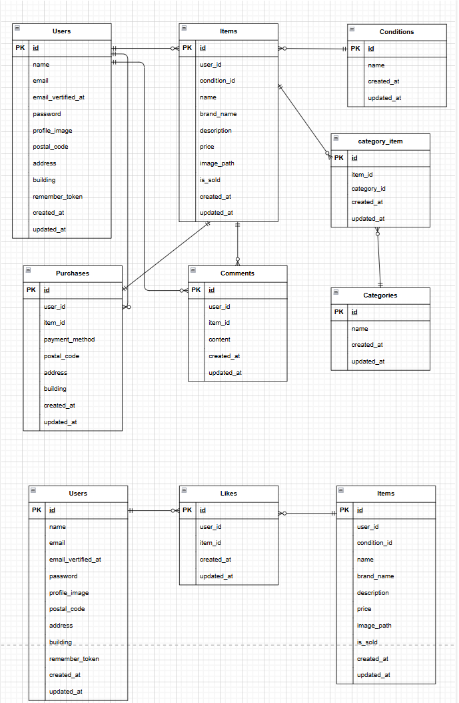

## アプリ名

フリマアプリ

## アプリ概要

ユーザーが商品を出品・購入できるアプリです。

## 環境構築

本アプリケーションは Docker を使用して構築しています。

## 使用技術（実行環境）

- git clone git@github.com:Aya-Kawa/flea_market_test.git
- cd flea_market_test
- docker-compose up -d --build

## Laravel環境構築

- docker-compose exec php bash
- composer install
- cp .env.example .env
- php artisan key:generate
- php artisan migrate
- php artisan db:seed
- php artisan storage:link
  ※ .env は必要に応じて DB 設定を調整してください。

##　メール認証について
本アプリでは会員登録後、メール認証が必要です。開発環境ではMailtrapを使用しています。
認証メールは実際のメールアドレスには送信されず、Mailtrap上で確認できます。

## メール認証設定

\*Mailtrapのアカウント作成およびSMTP情報の取得が必要です。
'.env'に以下を設定してください

```env
MAIL_MAILER=smtp
MAIL_HOST=sandbox.smtp.mailtrap.io
MAIL_PORT=2525
MAIL_USERNAME=××××××××××
MAIL_PASSWORD=××××××××××
MAIL_ENCRYPTION=null
MAIL_FROM_ADDRESS=test@gmail.com
MAIL_FROM_NAME="Laravel Test"
```

## Stripe設定

Stripeを使用して商品購入機能を実装しています。
'.env'に以下を設定してください

```env
STRIPE_KEY=pk_test_×××××××××××
STRIPE_SECRET=sk_test_××××××××××
```

## 開発環境URL

- 商品一覧画面:http://localhost/
- 会員登録画面:http://localhost/register
- ログイン画面:http://localhost/login
- マイページ:http://localhost/mypage

## 使用技術（実行環境）

- PHP 8.1
- Laravel 8.75
- MySQL
- nginx
- Docker / Docker Compose

## ER図


